# 2026-03-21 Handover — from sf-ep-dev-vibe-coding session

## Task
Update the Vercel dashboard at https://sf-vibe-dashboard.vercel.app/ to display the latest system architecture diagram including all MD file names.

## Context
A full day was spent today designing a unified multi-AI workspace structure (~/AI-Workspace/) collaboratively between Claude Code and Codex. The final system architecture diagram was validated by both AIs and saved at:

```
~/AI-Workspace/docs/system-architecture.md
```

This diagram is the source of truth for what needs to be displayed in the dashboard.

## What the Diagram Shows
- Full vibe coding system architecture
- All MD files with their names and Tier classification
- Claude Code and Codex AI tools
- MCP servers (GitHub MCP + Salesforce MCP)
- Project repos with symlinks
- Cloud services (GitHub, Salesforce Orgs, Vercel)
- Color coded by type:
  - Orange = Tier 1 cross-AI standards
  - Blue = Tier 2 Claude files
  - Teal = Tier 2 Codex files
  - Light blue = Tier 3 Claude project files
  - Light green = Tier 3 Codex project files
  - Yellow = Templates
  - Gray = Infrastructure

## Key Decisions Made Today
- ~/AI-Workspace/ structure built with 3-tier governance model
- standards/ = cross-AI governance (6 files)
- agents/claude/ and agents/codex/ = per-AI versioned sources
- docs/ = reference documentation (new directory)
- projects/ = symlinks to actual repos
- Codex uses AGENTS.md as primary project context (not CODEX.md)
- ~/.codex/config.toml = Codex runtime config (configures Codex)
- ~/.claude/CLAUDE.md = Claude global rules (loaded by Claude Code)

## Final Validated Mermaid Diagram

```mermaid
graph TB
    classDef tier1 fill:#f4a261,stroke:#e76f51,color:#000
    classDef tier2claude fill:#457b9d,stroke:#1d3557,color:#fff
    classDef tier2codex fill:#2a9d8f,stroke:#264653,color:#fff
    classDef tier3claude fill:#a8dadc,stroke:#457b9d,color:#000
    classDef tier3codex fill:#95d5b2,stroke:#2a9d8f,color:#000
    classDef template fill:#e9c46a,stroke:#f4a261,color:#000
    classDef infra fill:#adb5bd,stroke:#6c757d,color:#000

    subgraph LocalPC
        subgraph DotClaude
            GCL["~/.claude/CLAUDE.md\nTier2 Claude Global"]
        end
        subgraph DotCodex
            CCT["~/.codex/config.toml\nTier2 Codex Runtime Config"]
        end
        subgraph AIWorkspace
            WCL["AI-Workspace/CLAUDE.md\nTier2 Claude Workspace"]
            subgraph Standards
                AR["AI-RULES.md"]
                RP["rule-precedence.md"]
                CR["crud-rights.md"]
                DS["deployment-safety.md"]
                BS["branch-strategy.md"]
                VR["validation-rules.md"]
            end
            subgraph Agents
                subgraph AgentClaude
                    ACL["agents/claude/CLAUDE.md"]
                    ACT["agents/claude/templates/\nPROJECT-RULES.template.md"]
                end
                subgraph AgentCodex
                    ACD["agents/codex/CODEX.md"]
                    ACDT["agents/codex/templates/\nAGENTS.template.md"]
                end
            end
            subgraph SharedTemplates
                PRT["templates/PR.template.md"]
            end
            subgraph Projects
                SL1["sf-ep symlink"]
                SL2["sf-ps symlink"]
                SL3["sf-vercel symlink"]
                SL4["sf-ss symlink - planned"]
            end
        end
        subgraph ClaudeRepos
            R1["sf-ep-dev-vibe-coding\nCLAUDE.md / .mcp.json / memory/"]
            R2["sf-ps-dev-vibe-config\nCLAUDE.md / .mcp.json / memory/"]
            R3["sf-vercel-prd-vibe-dashboard\nCLAUDE.md / .mcp.json / memory/"]
        end
        subgraph CodexRepos
            R4["sf-ss-prd-vibe-config\n.mcp.json / memory/"]
            AGM["sf-ss/AGENTS.md\nCodex Project Context"]
        end
        subgraph MCPServers
            SFMCP["Salesforce MCP"]
            GHMCP["GitHub MCP"]
        end
        CC["Claude Code"]
        CX["Codex - planned"]
    end

    subgraph Cloud
        subgraph GitHub
            GH1["sf-ep repo"]
            GH2["sf-ps repo"]
            GH3["sf-vercel repo"]
            GH4["sf-ss repo - planned"]
        end
        subgraph SFOrgs
            ORG1["my-dev-org\nPartner Developer"]
            ORG2["sf-ps-dev-org\nPro Suite"]
            ORG3["sf-ss-prd-org - planned"]
        end
        VCL["Vercel Production"]
    end

    Dev([Developer])

    Dev -->|instructions| CC
    Dev -->|instructions| CX

    GCL -->|1st loaded| CC
    WCL -->|2nd loaded| CC
    R1 -->|3rd loaded| CC

    CCT -->|configures| CX
    AGM -->|project context| CX

    CC -->|manages| R1
    CC -->|manages| R2
    CC -->|manages| R3
    CC -->|calls| MCPServers

    CX -->|manages| R4
    CX -->|calls| MCPServers

    SL1 -.->|symlink| R1
    SL2 -.->|symlink| R2
    SL3 -.->|symlink| R3
    SL4 -.->|symlink| R4

    AGM --o R4

    SFMCP -->|REST API| SFOrgs
    GHMCP -->|GitHub API| GitHub

    R1 -->|git| GH1
    R2 -->|git| GH2
    R3 -->|git| GH3
    R4 -.->|git| GH4

    R1 -->|sf deploy| ORG1
    R2 -->|sf deploy| ORG2
    R4 -.->|sf deploy| ORG3
    R3 -->|deploy| VCL
    GH3 -->|auto-deploy| VCL

    Standards -.->|governs| CC
    Standards -.->|governs| CX
    ACL -.->|sync| GCL
    ACD -.->|guides| CCT

    class AR,RP,CR,DS,BS,VR tier1
    class GCL,WCL,ACL tier2claude
    class CCT,ACD tier2codex
    class R1,R2,R3 tier3claude
    class R4,AGM tier3codex
    class ACT,ACDT,PRT template
    class SL1,SL2,SL3,SL4,SFMCP,GHMCP infra
```



## Files to Reference Before Starting
- ~/AI-Workspace/docs/system-architecture.md  ← final diagram source
- ~/AI-Workspace/standards/AI-RULES.md        ← governance context
- ~/AI-Workspace/CLAUDE.md                    ← workspace rules

## GitHub Issue
Open a new GitHub Issue in sf-vercel-prd-vibe-dashboard before starting work.
Suggested title: "Update system architecture diagram on dashboard"

## Notes
- Retrieve latest metadata from the repo before making any changes
- Commit before deploying
- Vercel auto-deploys on push to main
